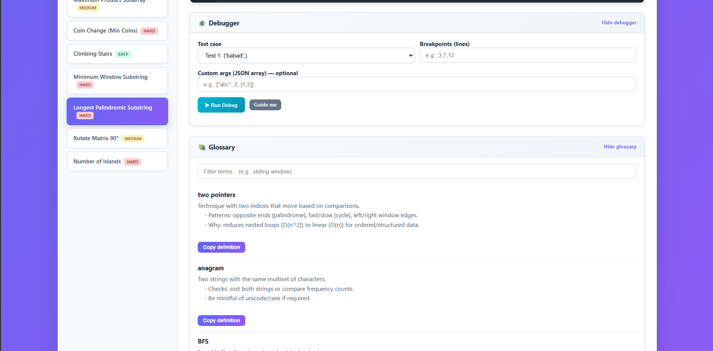
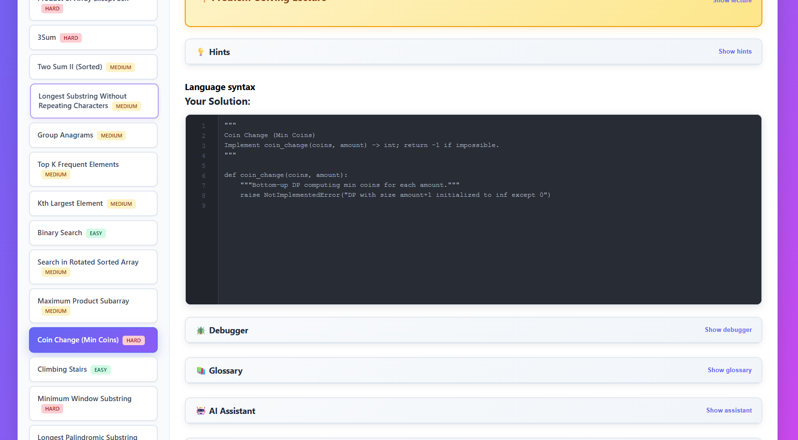
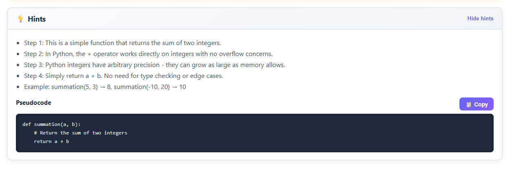

<div align="center">

# 💎 Multi-Language Assessment Practice

### _Master coding interviews with an interactive, feature-rich practice environment_


[Features](#-features) • [Screenshots](#-screenshots) • [Quick Start](#-quick-start) • [Problems](#-problem-library) • [Tech Stack](#-tech-stack)

</div>

---

## ✨ Overview

A comprehensive **practice assessment platform** designed to mirror real-world coding interviews (JPMC/Glider-style). Features a beautiful modern UI with integrated learning tools, time tracking, AI assistance, and instant code testing across multiple programming languages.

Perfect for interview prep, algorithm practice, and developing systematic problem-solving skills.

---

## 🎯 Features

### 🔥 Core Functionality
- **24 Curated Problems** — Easy to Hard difficulty spanning essential algorithms and data structures
- **Multi-Language Support** — Write solutions in Python, JavaScript, Java, C++, and more
- **Instant Testing** — Run test cases with immediate feedback and detailed results
- **Code Editor** — Syntax highlighting, line numbers, and auto-indentation
- **Test Debugger** — Set breakpoints, step through code, inspect custom test cases

### 📚 Learning Tools
- **🎓 Problem-Solving Lecture** — UMPIRE framework and systematic thinking methodology
- **📖 Language Cheat Sheets** — Quick reference guides for Python, JavaScript, Java, C++, Rust
- **💡 Enhanced Hints** — Step-by-step breakdowns with traced examples and complexity analysis
- **📝 Problem-Solving Notepad** — Structured template for the UMPIRE method
- **🔍 Glossary** — Searchable definitions for algorithm terms and patterns
- **🤖 AI Assistant** — Context-aware help with your code and problem descriptions

### ⏱️ Progress Tracking
- **Session Timer** — Track time spent per problem
- **History Dashboard** — View all attempts with timestamps and duration
- **Statistics** — Total time, problems solved, average time per problem
- **Persistent State** — LocalStorage saves your code, preferences, and progress

### 🎨 Modern UI/UX
- **Gradient Design** — Beautiful blue-to-purple gradient with glassmorphism effects
- **Collapsible Sections** — Expandable notepad, cheat sheets, lecture, hints, and debugger
- **Responsive Layout** — Optimized for desktop and laptop screens
- **Dark Theme** — Eye-friendly code editor with syntax highlighting
- **Interactive Tour** — 10-step guided walkthrough for new users
- **Keyboard Shortcuts** — Ctrl+Enter to run tests, quick navigation

---

## 📸 Screenshots

<div align="center">

### 🖥️ Main Dashboard

*Problem list with difficulty badges, timer, and statistics*

### ⌨️ Code Editor & Tools

*Integrated code editor with debugger, hints, and AI assistant*

### 🎓 Learning Resources

*Lecture section, cheat sheets, notepad, and glossary in action*

### 📋 Problem Selection & Interface

*Clean problem selection interface with sidebar navigation*

### 💡 Hints & Guidance System

*Step-by-step hints with complexity analysis and examples*

### 🧪 Test Results & Debugging

*Detailed test case results with pass/fail indicators*

### 🔍 Code Debugging Features

*Interactive debugger with breakpoints and variable inspection*

### 📚 Language Cheat Sheets

*Quick reference guides for multiple programming languages*

### 🎓 UMPIRE Framework Lecture

*Comprehensive problem-solving methodology and best practices*

### 📝 Problem-Solving Notepad

*Structured notepad for applying the UMPIRE method*

### 🔤 Algorithm Glossary

*Searchable glossary of common algorithms and data structures*

</div>

---

## 🚀 Quick Start

### Prerequisites
- Python 3.8 or higher
- Flask 3.0+
- Modern web browser (Chrome, Firefox, Edge)

### Installation

1. **Clone the repository**
   ```bash
   git clone https://github.com/TruZillah/Assessment-GliderAI.git
   cd Assessment-GliderAI
   ```

2. **Install dependencies**
   ```bash
   pip install flask
   ```

3. **Start the Flask server**
   ```bash
   python app.py
   # or on WSL:
   wsl python3 app.py
   ```

4. **Open in browser**
   ```
   http://127.0.0.1:5000
   ```

5. **Start practicing!** 🎉
   - Select a problem from the sidebar
   - Write your solution in the code editor
   - Click "Run Tests" or press Ctrl+Enter
   - Use hints, cheat sheets, and the lecture for guidance

### AI Assistant — OpenAI configuration

This project includes an optional AI assistant that uses the OpenAI API. The app loads a `.env` file at startup (and a small loader will also pick up valid keys and set them in the environment). To enable the assistant you need to provide a valid OpenAI API key.

How to get an OpenAI API key (for beginners)

1. Create an OpenAI account
   - Open your browser and go to https://platform.openai.com/signup and follow the sign-up flow (email verification may be required).

2. Visit the API keys page
   - After signing in, open https://platform.openai.com/account/api-keys. This is where you can create and manage secret API keys.

3. Create a new secret key
   - Click **Create new secret key** (or similar). Copy the key immediately and store it somewhere safe — you won't be able to view the full key again from the dashboard.

4. Billing and model access
   - New accounts may need to add a payment method to use paid models (for example, gpt-4). OpenAI sometimes provides free trial credits for new users; check the dashboard for any available credits.
   - If you don't have access to gpt-4 via the API, use `gpt-3.5-turbo` as the `OPENAI_MODEL` value (it is lower-cost and widely available).

5. Important security notes
   - Treat API keys like passwords. Do not share them, paste them in public forums, or commit them to git. The repo already excludes `.env` in `.gitignore`.
   - If a key is leaked, revoke it immediately from the OpenAI dashboard and create a new one.

Note: the ChatGPT web UI (chat.openai.com) does not provide an API key you can use here — you must create an API key on platform.openai.com.

Where to put the key
- Create a file named `.env` in the project root (the same folder as `app.py`). The repository already ignores `.env` in `.gitignore` so your key won't be accidentally committed.

Example `.env` content
```text
OPENAI_API_KEY=sk-<your-secret-key-here>
# Optional: switch model (default: gpt-4)
OPENAI_MODEL=gpt-4
```

Windows (cmd.exe) quick options
- Create the file using Notepad (recommended to avoid shell quoting issues):
```cmd
notepad .env
# paste the OPENAI_API_KEY line and save
```
- Or set it temporarily in the current shell (effective until you close the terminal):
```cmd
set OPENAI_API_KEY=sk-<your-secret-key-here>
python app.py
```

PowerShell (optional)
```powershell
$env:OPENAI_API_KEY = 'sk-<your-secret-key-here>'
python app.py
```

Important notes
- To pick up changes in `.env` you must restart the Flask server — the app reads `.env` on startup. The repository includes a small loader and validator in `app.py` that checks for a key starting with `sk-` and will load `OPENAI_API_KEY` if valid.
- Keep your API key secret. Do not paste it into public places or share it in commits. The repo already contains `.gitignore` with `.env` listed.
- If you don't set a key the UI will show the AI controls disabled and the app will continue to work for running problems and tests without the assistant.

Verify it's loaded
- In cmd:
```cmd
echo %OPENAI_API_KEY%
```
- In PowerShell:
```powershell
echo $env:OPENAI_API_KEY
```

Run all tests without the web interface:
```bash
python run_tests.py
```

---

## 📚 Problem Library

### 🟢 Easy (8 problems)
| Problem | Description | Key Concepts |
|---------|-------------|--------------|
| **Sum of Two Integers** | Return the sum of two integers | Basic arithmetic |
| **Is Palindrome** | Check if string is palindrome (ignore case/non-alphanumeric) | Two pointers, string manipulation |
| **Second Largest** | Find second largest distinct value | Array traversal, duplicates |
| **Two Sum** | Find indices of two numbers that sum to target | Hash map, complement search |
| **Balanced Brackets** | Validate balanced parentheses/brackets | Stack, matching pairs |
| **Climbing Stairs** | Count ways to climb n stairs (1 or 2 steps) | Dynamic programming, Fibonacci |
| **Binary Search** | Search for target in sorted array | Divide and conquer, binary search |
| **Two Sum II (Sorted)** | Two sum variant on sorted array | Two pointers on sorted data |

### 🟡 Medium (10 problems)
| Problem | Description | Key Concepts |
|---------|-------------|--------------|
| **Frequency Sort** | Sort characters by frequency, then lexicographically | Hash map, custom sorting, Counter |
| **Merge Intervals** | Merge overlapping intervals | Sorting, interval merging |
| **Maximum Subarray Sum** | Find max sum of contiguous subarray | Kadane's algorithm, DP |
| **Product Except Self** | Array of products excluding self (no division) | Prefix/suffix products |
| **3Sum** | Find all unique triplets summing to zero | Sorting, two pointers, duplicates |
| **Longest Substring w/o Repeats** | Longest substring with unique characters | Sliding window, hash set |
| **Group Anagrams** | Group words that are anagrams | Hash map with sorted keys |
| **Top K Frequent Elements** | Find k most frequent elements | Counter, heap, bucket sort |
| **Kth Largest Element** | Find kth largest in array | Quick select, heap |
| **Search in Rotated Array** | Binary search in rotated sorted array | Modified binary search |

### 🔴 Hard (6 problems)
| Problem | Description | Key Concepts |
|---------|-------------|--------------|
| **Coin Change (Min Coins)** | Minimum coins to make amount | Dynamic programming, BFS |
| **Minimum Window Substring** | Smallest window containing all target chars | Sliding window, two pointers |
| **Longest Palindromic Substring** | Find longest palindromic substring | Expand around center, DP |
| **Maximum Product Subarray** | Max product of contiguous subarray | DP with min/max tracking |
| **Rotate Matrix 90°** | Rotate n×n matrix in-place | Matrix transposition, reflection |
| **Number of Islands** | Count islands in 2D grid | DFS, BFS, union-find |

---

## 🛠️ Tech Stack

| Technology | Purpose |
|------------|---------|
| **Flask** | Python web framework for backend API |
| **JavaScript** | Interactive UI, code editor, state management |
| **HTML/CSS** | Modern gradient UI with glassmorphism |
| **LocalStorage** | Persistent client-side data storage |
| **CodeMirror-style Editor** | Syntax highlighting and code editing |

---

## 🎯 Use Cases

- ✅ **Interview Preparation** — Practice problems similar to JPMC, Google, Amazon interviews
- ✅ **Algorithm Learning** — Systematic approach with UMPIRE framework
- ✅ **Coding Bootcamps** — Teaching resource with built-in learning tools
- ✅ **Personal Skill Development** — Track progress and improve problem-solving
- ✅ **Mock Assessments** — Timed practice sessions with statistics

---

## 📖 Documentation

- [FEATURES.md](FEATURES.md) — Complete feature list and detailed descriptions
- [MULTI_LANGUAGE.md](MULTI_LANGUAGE.md) — Multi-language support documentation
- [CONTRIBUTING.md](CONTRIBUTING.md) — Contribution guidelines (coming soon)

---

## 🤝 Contributing

Contributions are welcome! Whether it's bug reports, feature requests, or new problem submissions:

1. Fork the repository
2. Create a feature branch (`git checkout -b feature/AmazingFeature`)
3. Commit your changes (`git commit -m 'Add some AmazingFeature'`)
4. Push to the branch (`git push origin feature/AmazingFeature`)
5. Open a Pull Request

---

## 📄 License

This project is licensed under the MIT License.

---

<div align="center">

**Built with ❤️ for developers preparing for coding interviews**

[⬆ Back to Top](#-multi-language-assessment-practice)

</div>
